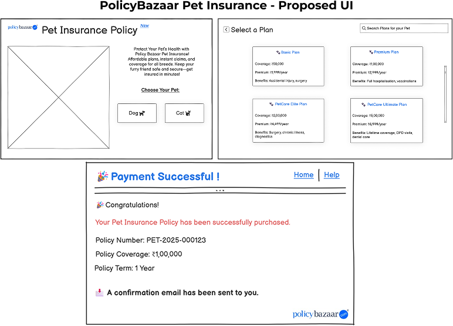

# PolicyBazaar Pet Insurance Project

## 📌 Project Overview
This repository contains the complete **business analysis and solution design** for adding a **Pet Insurance** product to the PolicyBazaar platform.  
It demonstrates the **full BA documentation lifecycle** — from requirements gathering to traceability and testing — for a real-world product feature enhancement.

---

## 🏦 Problem Statement
PolicyBazaar currently offers:
- Health Insurance
- Life Insurance
- Automobile Insurance

While leading in individual and family insurance markets, PolicyBazaar is missing opportunities in the **pet insurance** segment.  
Competitors offering pet coverage are attracting customers, resulting in:
- Loss of revenue
- Reduced market share
- Lower customer engagement

---

## 💡 Proposed Solution
Integrate a **Pet Insurance** category into the existing PolicyBazaar website:
- Coverage for **cats and dogs** of any breed
- Hassle-free claims for treatments, vaccinations, and checkups
- Seamless purchase via the existing payment gateway
- Instant confirmation popup and email with policy document

---

## 📂 Repository Contents

| Folder/File | Description |
|-------------|-------------|
| **1_BRD** | Business Requirements Document – project background, high-level requirements, and scope |
| **2_FRD** | Functional Requirements Document – detailed system features and workflows |
| **3_User_Stories** | Agile user stories with acceptance criteria |
| **4_Use_Cases** | Use case diagrams and detailed descriptions |
| **5_Wireframes** | PNG images of the digital insurance UI (main page, choose pet, choose plan, policy details, payment flow, etc.) |
| **6_Process_Flows** | As-Is and To-Be diagrams showing workflow changes |
| **7_Test_Cases** | Test case documents for functional validation |
| **8_RTM** | Requirements Traceability Matrix mapping requirements to test cases |

---

## 🛠 Tools & Techniques Used
- **Documentation:** Microsoft Word  
- **Wireframing:** Balsamiq / Figma / Axure RP  
- **Process Flows:** Lucidchart / Visio  
- **Testing & Traceability:** Excel, Jira  
- **Analysis:** Use Case Modelling, Requirements Elicitation

---

## 📸 Wireframe Previews
.png)  
.png)  
.png)  
.png)  
.png)  
.png)

---

## 📊 Process Flow Samples
  

---

## 🎯 Key Features in the Proposed System
- Homepage **Pet Insurance** tab
- Pet-type selection (Dog / Cat)
- Plan listings with summaries
- Detailed plan page with coverage, benefits, and pricing
- Online purchase form with payment integration
- Confirmation popup and policy email delivery

---

## 👩‍💼 About This Project
This project is part of my **Business Analyst portfolio**, demonstrating my ability to create complete BA documentation for a product feature enhancement in an existing digital platform.

**Author:** Rishikesh Choudhary  
**LinkedIn:** [Rishikesh Choudhary](https://www.linkedin.com/in/rishikesh-choudhary-ba-166100377)  
**Email:** rishikeshchoudhary.ba@gmail.com
